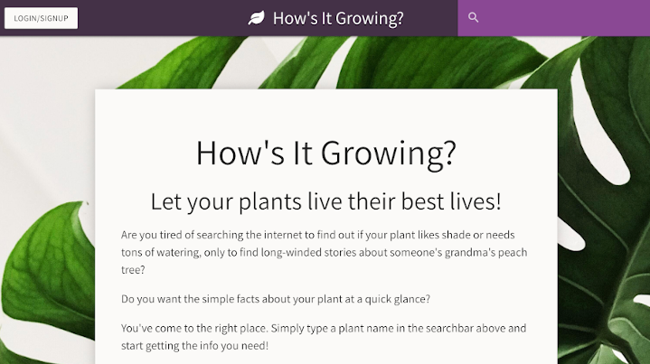

# How's It Growing?

## Description

An application to help you keep your plant alive and green. You can search for plants and get information for taking care of your plant such as watering, temperature, or amount of shade needed. You can create an account and save your plants to a collection. Saving a plant to a collection will generate more information about that plant such as type, family, and soil fertility.

The following image shows a glimpse of the application:

## Getting Started

This is a simple application that runs right in the browser, no installation or downloads needed. This application is not currently deployed.

## Built With:

MongoDB - database 
Express - server 
React - JavaScript library 
Node.js - JavaScript runtime

## Authors:

Brittany Fortner  
Dennis Amparo 
Jim Denis 
John Telban 
 
See commit history [here](https://github.com/bfeliz/plant-power/graphs/contributors).

## Planned Updates

Planned updates include adding recommended plants based on saved plants, personalizing background, and matching plants to pots.
